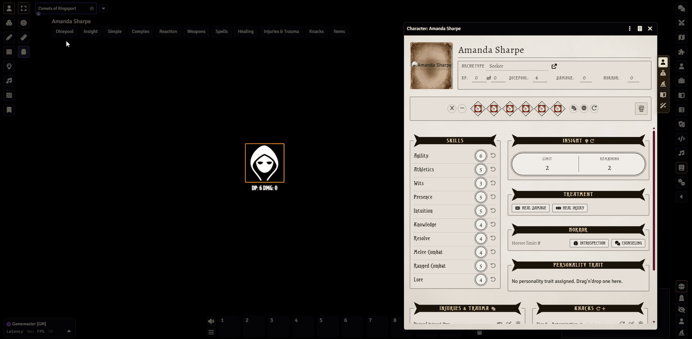

# Token Action HUD Arkham Horror RPG

System module for [**Token Action HUD Core**](https://foundryvtt.com/packages/token-action-hud-core) that adds a fast action HUD for the [**Arkham Horror RPG (FVTT)**](https://github.com/MrTheBino/arkham-horror-rpg-fvtt) system.

***Demo above running Arkham Horror v14.2 and Token Action HUD Arkham Horror RPG v14.1***

## Requirements

- Foundry VTT: `>= v13.351`
- [**Arkham Horror RPG (FVTT)**](https://github.com/MrTheBino/arkham-horror-rpg-fvtt): `>= 13.0.35`
- [**Token Action HUD Core**](https://foundryvtt.com/packages/token-action-hud-core): `>= 2.1.1`

> [!IMPORTANT]
> **Upgrading from module 14.0.0 or earlier:** Version 14.1.0 changes the default HUD group structure. Token Action HUD Core does not merge new defaults into a saved customized layout. After upgrading, reload the world. If the split Weapons groups or the new Healing, Injury & Trauma, Knacks, and Items groups are missing, follow [Upgrading Existing HUD Layouts](#upgrading-existing-hud-layouts).

## Available in 14.1.0+
This is considered a **stable release build** and is mostly feature complete at this stage. We will continue to update for Foundry, TAH Core and underlying Arkham Horror RPG system enhancements.

### Rolls and Actions

- **Simple** — Spend a Regular Die or Horror Die.
- **Complex** — Roll any available skill through the system dice roll dialog.
- **Reaction** — Roll skills in reaction mode through the system dice roll dialog.
- **Weapons** — Browse owned weapons by **Melee Combat**, **Ranged Combat**, or **Other**, then open the system weapon roll dialog.
- **Spells** — Browse owned spells and open the system spell roll dialog.
- **Injury & Trauma** — Roll for Injury & Trauma and view the actor's current Injuries and Traumas.

### Resources and Recovery

- **Dicepool** — Adjust Dicepool, Damage, and Horror; Refresh; Discard Die; Discard All Dice; or Strain.
- **Insight** — Spend or Refresh Insight through the system workflow.
- **Healing** *(Arkham Horror RPG 14.2+ only)* — Access Treatment (**Heal Damage**, **Heal Injury**), Horror recovery (**Introspection**, **Counseling**), and GM-only **Recovery**.

### Character Knacks and Items

- **Knacks** — Browse non-tiered Knacks, Tier 1 through Tier 4 Knacks, and NPC Weaknesses, and open their item sheets.
- **Items** — Open owned Protective Equipment, special rules-bearing Useful Items, Relics, Tomes, and Favors directly from the HUD.

### Tooltips!

Knacks, Weapons, Spells, and Items support Token Action HUD Core's **Display Icons** preference. Full tooltip mode provides compact, enriched Arkham statistics, rules, and reference details where available.

## Upgrading Existing HUD Layouts

Token Action HUD Core preserves saved user and actor layouts and does not merge new module defaults into them. After upgrading and reloading the world, inspect the HUD before taking action. If the new groups are already present, do not reset the layout.

When this module detects that groups introduced by the current layout are missing on the first HUD build, it shows that client a one-time persistent warning pointing to this upgrade guide.

### Quick Option: Reset Layout

Each affected user can select a token, unlock the HUD, open **Edit HUD** (pencil icon), and choose **Reset Layout**.

This rebuilds the HUD from the current module defaults, but it also clears:

- The current user's saved group arrangement, custom groups, and HUD position.
- The selected actor's saved HUD group settings and action selections.

It does **not** modify the actor document, items, resources, or other Arkham Horror RPG game data.

### Preserve a Customized Layout

Token Action HUD Core 2.1 does not currently provide a command that merges new module defaults into an existing saved layout. To preserve a customized layout, unlock the HUD and use its `+` controls and context menus to update it manually:

1. Under **Weapons**, remove the old Weapons subgroup and add **Melee Combat**, **Ranged Combat**, and **Other**.
2. Under **Injury & Trauma**, remove the old subgroup and add **Actions**, **Injury**, and **Trauma**.
3. Add a **Healing** top-level group on Arkham Horror RPG 14.2+ and add **Treatment**, **Horror**, and **Recovery**.
4. Add a **Knacks** top-level group and add **Knacks**, **Tier 1** through **Tier 4**, and **Weaknesses**.
5. Add an **Items** top-level group and add **Protective Equipment**, **Useful Items**, **Relics**, **Tomes**, and **Favors**.

## Compatibility Mode v13.0.3

- `Arkham < 13.0.37`: legacy compatibility mode (existing dynamic-import routing).
- `Arkham >= 13.0.37`: API mode (routes through `game.arkhamhorrorrpgfvtt.api`).

API mode details:

- No legacy fallback if a required API method is missing in API mode.
- Missing methods fail closed (action is skipped and a warning is shown).
- Dicepool actions use system API methods instead of direct actor data writes.

Upgrade note:

- If you are on module `v13.0.2` and upgrade Arkham to `>= 13.0.37`, dicepool increment/decrement actions will not update correctly due to a system API breaking change.
- Upgrade this module to `v13.0.3` (or newer) when upgrading the base Arkham system.

## Installation

### Manifest URL

- `https://github.com/fresnoth/fvtt-token-action-hud-arkham-horror/releases/latest/download/module.json`

### Steps

1. In Foundry, go to **Add-on Modules** → **Install Module**.
2. Paste the manifest URL.
3. Install.
4. Enable **Token Action HUD Core** and **Token Action HUD Arkham Horror RPG** in your world.

## Development

- Install deps: `npm ci`
- Build minified bundle: `npm run build`
- Watch mode: `npm run dev`

### Smoke Testing

- Run the Foundry smoke checklist in `SMOKE-TEST.md` after making action routing changes.

Output bundle: `scripts/fvtt-token-action-hud-arkham-horror.min.js`

### Future Features

For planned work and deferred ideas, see [Future Features](futurefeatures.md).

## License

This Foundry VTT module is licensed under a [Creative Commons Attribution 4.0 International License](https://creativecommons.org/licenses/by/4.0/) and this work is licensed under [Foundry Virtual Tabletop EULA - Limited License Agreement for module development](https://foundryvtt.com/article/license/).